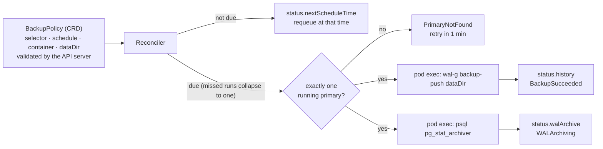
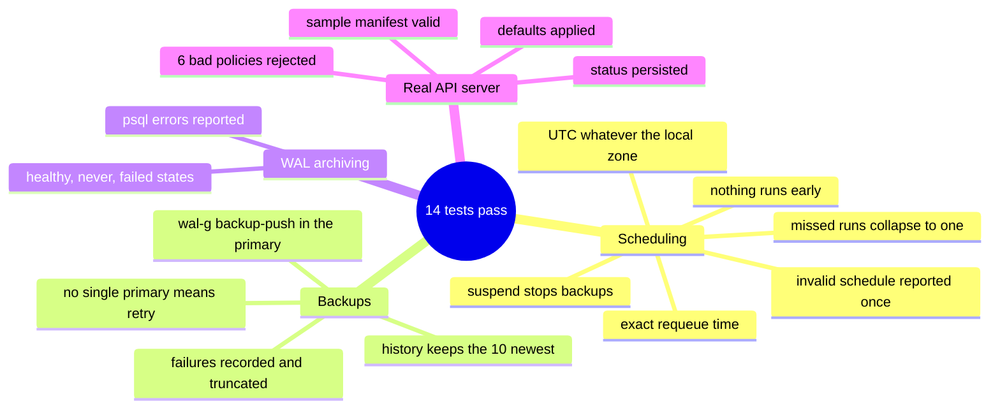

# db-backup-operator

[](https://github.com/EquinoxWN/db-backup-operator/actions/workflows/ci.yml)


> A backup you never tested is not a backup: an operator that backs up Postgres and proves each backup can actually be restored.

Part of my **DevOps and Cloud** list · Go · core project

## Architecture

**What M1 runs today:**



**Full roadmap (M1 to M3):**


## How it works

_Steps 1 and 2 are built and tested (M1); the rest is on the [roadmap](#roadmap)._

1. You declare a `BackupPolicy` custom resource: which Postgres cluster, the schedule, retention and how often to test a restore.
2. The controller runs WAL-G base backups on schedule and archives WAL continuously to S3-compatible storage, enabling point-in-time recovery.
3. On its own schedule it restores the latest backup into a throwaway namespace, replays WAL to a chosen timestamp and runs checksum queries against known data.
4. Each drill records restore time and the recovery point reached, so RTO and RPO are measured rather than promised.
5. Retention deletes an old backup only after a newer one has passed verification; finalizers clean up when the policy is removed.
6. Status conditions, events and metrics report every backup and drill; a kind e2e suite deletes the database and restores it automatically.

## Tech stack

| Area | Tools |
|---|---|
| Core | Go, controller-runtime, controller-gen (Kubebuilder markers) |
| Backup | WAL-G to MinIO (S3 API), continuous WAL archiving, point-in-time recovery |
| Test/Ship | envtest, kind e2e with automated restore drills, Helm chart |

Language: **Go** (controller-runtime 0.23, Kubernetes 1.35 libraries), code and manifests generated by `controller-gen`.

| Path | What it is |
|---|---|
| `api/v1alpha1/` | `BackupPolicy` types, validation markers, generated deepcopy |
| `internal/controller/` | Reconciler: schedule, primary lookup, `wal-g backup-push`, `pg_stat_archiver` check, status |
| `internal/podexec/` | Runs a command in a container through the Kubernetes exec API (argv, no shell) |
| `cmd/db-backup-operator/` | Manager with health probes and optional leader election |
| `config/crd/bases/`, `config/rbac/` | Generated CRD and least-privilege ClusterRole |
| `config/samples/backuppolicy.yaml` | A nightly policy, with the WAL-G setup the database pod needs |

## Run it

Needs Go 1.25+. No Docker or cluster for the tests.

```bash
make setup      # go mod download
make lint       # gofmt and go vet
make test       # reconciler unit tests (fake API client and pod executor)
make envtest    # same package against a real kube-apiserver and etcd (Linux, macOS or WSL)
make generate   # regenerate deepcopy, CRD and RBAC after changing api/
```

On a cluster: apply `config/crd/bases/` and `config/rbac/`, run the operator, then
`kubectl apply -f config/samples/backuppolicy.yaml` and watch `kubectl get backuppolicies` (short name `bp`).

## Tests and results

Latest local run (full detail in [docs/results/m1.md](docs/results/m1.md)):

| Check | Result |
|---|---|
| Reconciler unit tests: schedule, catch-up, failure, missing primary, suspend, WAL archiving states, time zone | 11 passed, 0 failed |
| Real API server (envtest, Kubernetes 1.35): defaults, 6 invalid or injection-shaped policies rejected, status writes, sample manifest | 3 passed, 0 failed |
| Bug found by the tests | Schedules ran in local time instead of UTC; fixed, with a regression test that fails if the bug returns |
| Generated RBAC | only `backuppolicies` (+status), `pods` read and `pods/exec` |

M1 takes backups and checks archiving; it does **not** yet prove a backup restores. That is M2's restore drills.

### Test map



## Roadmap

**M1** (≈15 h)
- [x] Write `docs/rfc/0001-design.md`: problem, goals, non-goals, chosen design
- [x] You declare a `BackupPolicy` custom resource: which Postgres cluster, the schedule, retention and how often to test a restore.
- [x] The controller runs WAL-G base backups on schedule and archives WAL continuously to S3-compatible storage, enabling point-in-time recovery.

**M2** (≈20 h)
- [ ] On its own schedule it restores the latest backup into a throwaway namespace, replays WAL to a chosen timestamp and runs checksum queries against known data.
- [ ] Each drill records restore time and the recovery point reached, so RTO and RPO are measured rather than promised.

**M3** (≈25 h)
- [ ] Retention deletes an old backup only after a newer one has passed verification; finalizers clean up when the policy is removed.
- [ ] Status conditions, events and metrics report every backup and drill; a kind e2e suite deletes the database and restores it automatically.
- [ ] Publish the proof below with real numbers

## Proof

What this repo must show before it counts as done:

- A restore-drill history where every backup is verified, with measured restore time and data loss.

| Result | Value |
|---|---|
| M3 proof above | Not measured yet (M3). Current M1 numbers: see [Tests and results](#tests-and-results). |

## Why it matters

- **Interview angle:** 'Design backup and disaster recovery for a database'.
- **Upstream I'm contributing to:** Cybozu's MOCO MySQL operator or CloudNativePG.

## Design docs

- [RFC 0001: design](docs/rfc/0001-design.md)
- [ADR 0001: record architecture decisions](docs/adr/0001-record-architecture-decisions.md)
- [ADR 0002: run WAL-G inside the primary through pod exec, keep credentials out](docs/adr/0002-exec-into-primary-for-backups.md)
- [M1 results](docs/results/m1.md)

## Scope

This is a learning and portfolio system, not a hosted production service. Everything runs locally.

## Security and contributing

- Every GitHub Action is pinned to a commit SHA; workflows run read-only, without persisted credentials.
- Dependabot proposes dependency and action updates weekly.
- `gofmt`, `go vet`, the race detector and a generated-code drift check on every push; commands run as argv (no shell) and every user field reaching them is schema-restricted; the operator never holds storage credentials; `govulncheck` (`make audit`) in CI.
- Report vulnerabilities privately: see [SECURITY.md](SECURITY.md). To contribute, see [CONTRIBUTING.md](CONTRIBUTING.md).

## License

MIT, see [LICENSE](LICENSE).
