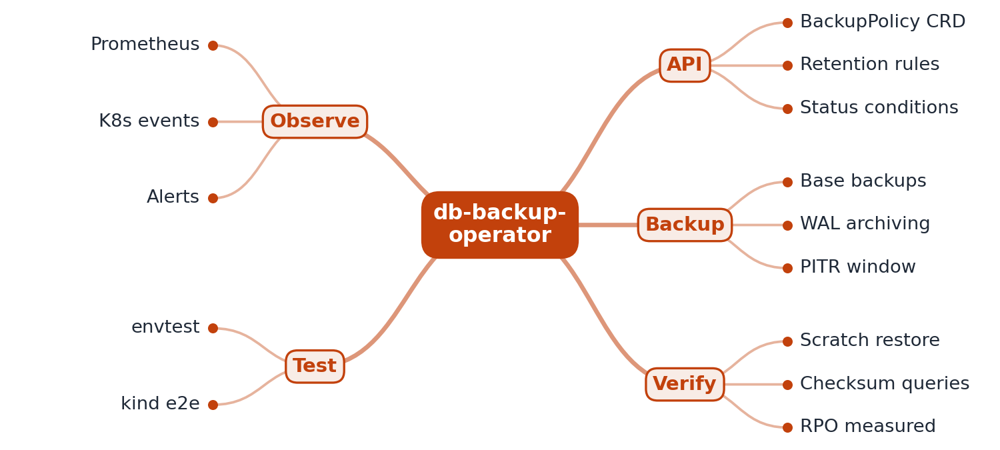

# RFC 0001: db-backup-operator design

- **Status:** Accepted (M1 implemented)
- **Author:** EquinoxWN
- **Created:** 2026

## Problem

Most teams find out their database backups do not work on the day they need them: the cron job
stopped months ago, WAL archiving silently failed, or nobody ever tried a restore. In Kubernetes
the backup is usually a script someone wrote once, with no status anywhere. This operator makes
backups declarative: a `BackupPolicy` object says what to back up and when, and its status shows
exactly what happened, so a missed or failed backup is visible immediately. Later milestones add
automated restore drills that prove each backup can actually be restored.

## Goals

- A `BackupPolicy` custom resource names the PostgreSQL primary (by label selector), the cron
  schedule and the container and paths to use; the API server validates it.
- The controller runs a WAL-G base backup (`wal-g backup-push`) inside the primary on schedule and
  records every attempt (scheduled time, start, end, result, error tail) in status.
- Continuous WAL archiving (PostgreSQL's `archive_command` running `wal-g wal-push`) is checked on
  every run through `pg_stat_archiver`, and reported as a condition, because point-in-time recovery
  depends on it as much as on the base backup.
- Missed runs (operator down) collapse into one catch-up backup; an invalid schedule is reported,
  not retried in a loop; a missing or ambiguous primary is retried without skipping the run.
- Later: restore drills into a throwaway namespace with measured RTO and RPO (M2), retention that
  deletes only after a newer backup is verified, finalizers, metrics and a kind e2e suite (M3).

## Non-goals

- Running PostgreSQL itself (that is the job of a Postgres operator or a StatefulSet).
- Handling storage credentials: WAL-G is configured inside the database container, where
  `archive_command` needs it anyway (ADR 0002).
- Running as a hosted production service.

## Proposed design



```
BackupPolicy (CRD, validated) ──► Reconcile
                                   ├─ schedule not due ─► status.nextScheduleTime, requeue at that time
                                   └─ due ─► find the single running primary pod (label selector)
                                             ├─ exec: wal-g backup-push <dataDir>      ─► history, BackupSucceeded
                                             └─ exec: psql ... FROM pg_stat_archiver   ─► walArchive, WALArchiving
```

| Part | M1 implementation |
|---|---|
| API | `dbbackup.equinoxwn.github.io/v1alpha1`, kind `BackupPolicy`, status subresource, printer columns |
| Validation | OpenAPI schema from kubebuilder markers: non-empty selector, schedule present, absolute `dataDir` without shell characters, DNS-style container name, SQL-identifier user |
| Scheduling | `robfig/cron` standard five-field schedule, always evaluated in UTC; requeue exactly at the next run |
| Execution | Kubernetes pod exec (WebSocket, falling back to SPDY) with an argv list, never a shell string; 2 h backup timeout, 30 s query timeout |
| Status | `lastScheduleTime`, `lastSuccessfulBackupTime`, `nextScheduleTime`, `walArchive`, 10 newest attempts, conditions `Ready`, `BackupSucceeded`, `WALArchiving` |
| RBAC | read policies, write their status, list pods, create `pods/exec`; nothing else |

## Alternatives considered

| Option | Why not (yet) |
|---|---|
| A Kubernetes CronJob per policy running `pg_basebackup` | Simple, but `wal-g backup-push` needs the data directory, a CronJob pod cannot see it, and CronJob status says nothing about WAL archiving (ADR 0002). |
| A sidecar with its own cron in the database pod | No central status and no single place to see whether backups work across databases. |
| Adopt CloudNativePG or Zalando's operator | They run Postgres and backups together; this project is about the backup and verification loop for any Postgres, and is the learning goal. |
| `pg_dump` logical backups | No point-in-time recovery, and too slow for large databases. |
| Mount storage credentials into the operator | A breach of the operator would expose every database's backups; keeping credentials in the database pod limits the blast radius. |

## Measurement plan

- M1: reconciler unit tests with a fake client and executor (schedule, catch-up, failures, missing
  primary, archiving states, time zones), and envtest tests against a real kube-apiserver and etcd
  (schema defaults and rejections, status writes, the sample manifest).
- M2: restore drills that restore into a throwaway namespace and run checksum queries; restore time
  and recovery point recorded per drill.
- M3: a restore-drill history in which every backup is verified, with measured RTO and RPO, and a
  kind e2e suite that deletes a database and restores it.

## Milestones

- **M1 (done):** CRD and validation, scheduled base backups through pod exec, WAL archiving check,
  status history and conditions, unit and envtest suites, generated RBAC.
- **M2:** restore drills, retention after verification, finalizers, Kubernetes events.
- **M3:** metrics and alerts, Helm chart, kind e2e with automated restore, proof table.

## Risks and open questions

- `pods/exec` is a powerful permission: whoever controls the operator can run commands in any pod
  it can list. M1 generates a ClusterRole; M2 will document a namespaced Role per database
  namespace and restrict exec to labelled pods with an admission policy.
- A successful `backup-push` is not a restorable backup. That is exactly what M2's restore drills
  prove; until then the README says backups are taken, not verified.
- The pod exec path is covered by unit tests through an interface, not against a real kubelet; the
  kind e2e suite in M3 covers it end to end.
